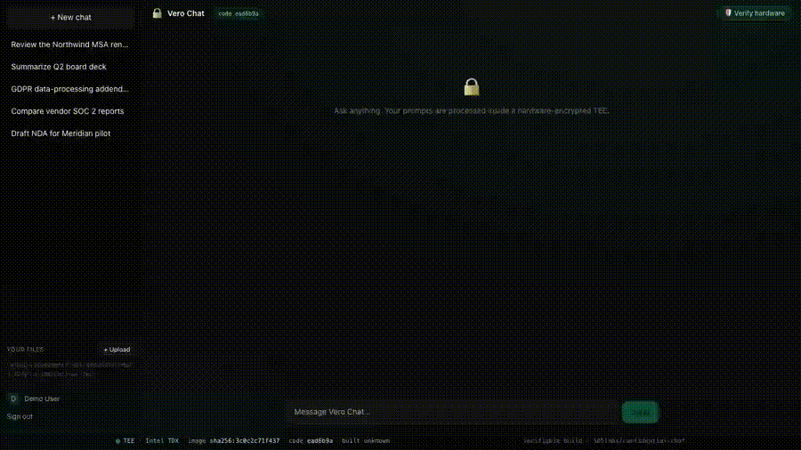

<!-- Header ------------------------------------------------------------------->
<div align="center">


<a href="https://github.com/505labs/confidential-chat/actions/workflows/build.yml"></a>


</div>

<!-- ASCII banner --------------------------------------------------------------->
```
  ██╗   ██╗███████╗██████╗  ██████╗      ██████╗██╗  ██╗ █████╗ ████████╗
  ██║   ██║██╔════╝██╔══██╗██╔═══██╗    ██╔════╝██║  ██║██╔══██╗╚══██╔══╝
  ██║   ██║█████╗  ██████╔╝██║   ██║    ██║     ███████║███████║   ██║
  ╚██╗ ██╔╝██╔══╝  ██╔══██╗██║   ██║    ██║     ██╔══██║██╔══██║   ██║
   ╚████╔╝ ███████╗██║  ██║╚██████╔╝    ╚██████╗██║  ██║██║  ██║   ██║
    ╚═══╝  ╚══════╝╚═╝  ╚═╝ ╚═════╝      ╚═════╝╚═╝  ╚═╝╚═╝  ╚═╝   ╚═╝
              v  e  r  o     ·     c  h  a  t     🔒
```

> **A self-hosted, private ChatGPT-style app where the language model runs inside a
> hardware-encrypted Trusted Execution Environment (TEE).** Sign in with Google, chat
> with a model whose weights and your prompts are encrypted *in use*, and verify —
> down to a **container digest** — exactly what code is running.

---

## 🎬 Demo

Start a chat, upload a confidential contract, and ask about its terms — then click
**Verify hardware** and watch the browser check an Intel-signed TDX attestation quote
on the spot:

<div align="center">

<a href="docs/demo/vero-chat-demo.mp4"></a>

<sub>▶️ <a href="docs/demo/vero-chat-demo.mp4">Watch the full-quality MP4</a> · recorded with <a href="https://github.com/505labs/confidential-chat/tree/demo-frontend-noauth/scripts/demo">scripts/demo</a></sub>

</div>

> The clip was captured on the auth-free **`demo-frontend-noauth`** branch (a
> frontend-only build with authentication removed and the chat/attestation APIs
> mocked, so the UI can be recorded without Google OAuth or the TEE model backend).
> The attestation panel mirrors the real TDX output byte-for-byte.

---

## 🔎 Verifiable by a hash, not by trust

This is the headline feature. The app is built **in the open** by GitHub Actions and
published to GHCR. That public build produces an image **digest**, and *the very same
digest* is what the running app shows in its footer — with each answer tagged by the
**git commit** that generated it.

<!-- DIGEST:START -->
<div align="center">

[](https://github.com/505labs/confidential-chat/pkgs/container/confidential-chat)
[](https://github.com/505labs/confidential-chat/commit/1de27ffcdf3c3f73c8ffa16c98d4c63ea906e547)

**🔒 Currently deployed in the TEE**

```
image   ghcr.io/505labs/confidential-chat@sha256:f5eb3c4f17e10b82c616a9f22e55a042b6f8e99bb83bb0062f2b1cdfbe6f5baf
commit  1de27ffcdf3c3f73c8ffa16c98d4c63ea906e547
built   2026-07-29T12:26:37Z  (UTC, by GitHub Actions)
```

<sub>Pull this exact image: <code>docker pull ghcr.io/505labs/confidential-chat@sha256:f5eb3c4f17e10b82c616a9f22e55a042b6f8e99bb83bb0062f2b1cdfbe6f5baf</code> — the digest above is what the running app shows in its footer.</sub>

</div>
<!-- DIGEST:END -->

**The chain of custody:**

```
  public source  ─▶  public GitHub Actions build  ─▶  ghcr.io/…@sha256:DIGEST
       │                                                        │
       │                                                        ▼
       └──────────  same DIGEST shown in the app footer  ◀──  deployed into the TEE
                    each reply tagged with its commit SHA
```

You don't have to trust a screenshot — pull the exact image yourself:
`docker pull ghcr.io/505labs/confidential-chat@sha256:<digest>`.

---

## ✨ What you get

- 🔐 **Model runs in a TEE** — Intel TDX encrypts the VM's RAM in hardware (with integrity protection); prompts and weights are protected *in use*, not just at rest.
- 🧾 **Provable hardware** — the app produces + self-verifies an Intel TDX attestation quote against Intel's root of trust (TDREPORT → TD Quote → DCAP), with **no cloud provider in the verification chain**.
- 🪪 **Google sign-in** — real per-user accounts via Google OAuth. Anyone with a Google account can sign in and use the app; API routes are per-IP rate-limited.
- 💾 **Local chat history** — a lightweight **SQLite** DB on the VM. No external database, no data leaving the box.
- 🧬 **Verifiable builds** — public CI → image digest → shown in-app + in this README; each reply carries the code commit hash.
- 🌐 **Real HTTPS, no domain** — automatic Let's Encrypt certs via `sslip.io`.

## 🏛️ Architecture

```
                          GCP Confidential VM  (Intel TDX Trust Domain · RAM encrypted + integrity)
   Public user            ┌──────────────────────────────────────────────────────┐
      │  HTTPS :443        │  caddy ── reverse proxy, auto Let's Encrypt           │
      └───────────────────┼─▶ app  ── Next.js chat UI                             │
                          │      ├─ Google OAuth (Auth.js)                         │
                          │      ├─ SQLite  (accounts + conversation history)      │
                          │      ├─ attestor ── TDX quote via configfs-tsm,        │
                          │      │              self-hosted DCAP (dcap-qvl)         │
                          │      └─▶ llama.cpp ── CPU inference                    │
                          │               └─▶ Qwen2.5-1.5B (GGUF)                  │
                          └──────────────────────────────────────────────────────┘
      Only :80/:443 exposed. Accounts + conversations never leave the VM.
      Footer shows the deployed image digest; each reply shows its code commit.
```

Full design + decision log: **[docs/ARCHITECTURE.md](docs/ARCHITECTURE.md)**.

## 🚀 Quickstart

```bash
# 1. Provision the Intel TDX Confidential VM (static IP + firewall)
gcloud config set project YOUR_PROJECT_ID
MACHINE=n2d-highcpu-8 ./infra/create-vm.sh        # prints the VM IP + PUBLIC_HOST

# 2. Create a Google OAuth client (Web) in the Cloud Console.
#    Authorized redirect URI:  https://<PUBLIC_HOST>/api/auth/callback/google

# 3. Deploy the app (pulls the CI-built image by digest, wires up Caddy + llama)
PUBLIC_HOST=<ip-with-dashes>.sslip.io ./deploy/deploy-app.sh
```

Then open `https://<PUBLIC_HOST>` — **any Google account can sign in and start chatting.**

Verify the TEE is genuine anytime:

```bash
./infra/verify-attestation.sh        # pulls a TDX quote, verifies it to Intel's root with dcap-qvl
```

## 🗂️ Repository layout

| Path | Purpose |
| --- | --- |
| `app/` | The custom Next.js chat app (Auth.js + SQLite + streaming). |
| `app/Dockerfile` | Multi-stage build → the image published by CI. |
| `.github/workflows/build.yml` | Public build → push to GHCR → update this README's digest. |
| `scripts/update-readme-digest.sh` | Rewrites the digest block above. |
| `deploy/docker-compose.vm.yml` | VM stack: llama.cpp + app (pinned by digest) + Caddy. |
| `deploy/deploy-app.sh` | Resolve the GHCR digest, template compose, deploy to the VM. |
| `infra/create-vm.sh` | Provision the Confidential VM + static IP + firewall. |
| `infra/verify-attestation.sh` | Request a TDX quote + verify it to Intel's root (self-hosted DCAP). |
| `docs/ARCHITECTURE.md` · `docs/DEPLOY.md` | Design/decision log · deploy runbook. |

## ⚙️ Configuration

The app reads its config from environment variables (see [`app/.env.example`](app/.env.example)):

| Variable | What it does |
| --- | --- |
| `AUTH_SECRET` | Auth.js session secret (`openssl rand -hex 32`). |
| `AUTH_GOOGLE_ID` / `AUTH_GOOGLE_SECRET` | Google OAuth client credentials. |
| `LLAMA_BASE_URL` / `LLAMA_API_KEY` | llama.cpp endpoint + key (inside the TEE). |
| `DB_PATH` | SQLite file path (mounted volume, defaults to `/data/app.db`). |
| `IMAGE_DIGEST` | Injected at deploy so the footer shows the running image's digest. |

> **Secrets never live in the repo** — only in the deploy environment. Regenerate them per deployment.

## 🖥️ Want a GPU?

For a larger model, run on a **confidential-mode NVIDIA GPU** (H100/H200) alongside the
TDX CPU Trust Domain — the GPU produces its own NVIDIA-signed attestation that composes
with the TDX quote. The CPU attestation flow is unchanged; the demo here is CPU-only to
keep costs down.

## 📜 License

[MIT](LICENSE) © 2026 Snojj25

<div align="center">

</div>
